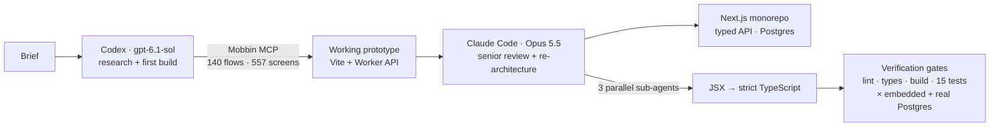

# How Xfield was built with AI

Xfield was built by one developer directing several AI agents: research agents, coding agents
and parallel sub-agents, each with a narrow brief and a verification gate. Every number on this
page comes from the captured transcripts in [`.agent-logs/`](../.agent-logs) or from the
repository itself.

## The pipeline

## Phase 1: research and first build (Codex)

|          |                                                                                     |
| -------- | ----------------------------------------------------------------------------------- |
| Agent    | Codex desktop, model `gpt-6.1-sol`                                                  |
| Research | Mobbin MCP: 140 product flows, 557 unique reference screens inventoried in `recon/` |
| Output   | A working prototype: studios, asset library, canvas, generation jobs, Worker API    |
| Log      | [`2026-10-02_18-53-04_…md`](../.agent-logs)                                         |

## Phase 2: senior review and re-architecture (Claude Code, Opus 5.5)

The second agent was briefed to review the code as a senior backend engineer and raise it to
production standard. Notable findings it made and fixed:

- The prompt-capture script had been silently dropping every response and every prompt after
  the fourth. Two root causes found and fixed; the missing entries were recovered from the
  original transcripts.
- API responses leaked the guest session credential that the cookie was meant to protect.
- Uploads trusted the browser's declared file type; now the file's bytes are checked.
- The generation rate limit could be bypassed with parallel requests; now it holds under a
  per-workspace database lock, proven by a test that fires ten requests at once.

It then rebuilt the project as a monorepo of four packages (`apps/web`, `packages/api`,
`packages/db`, `packages/shared`) with layered routes, controllers, services and infrastructure,
added accounts with secure password hashing, and moved storage to Postgres.

## Phase 3: parallel sub-agents

The final screen conversion was split across three Opus sub-agents running at the same time,
each with a written brief, an exclusive set of folders and the same verification command. Their
briefs and reports are logged verbatim.

| Sub-agent task                         | Wall time | Tokens | Bugs reported |
| -------------------------------------- | --------- | ------ | ------------- |
| Studio screen (≈540 lines)             | 104 s     | 95k    | 8             |
| Canvas, projects, assistant            | 103 s     | 89k    | 10            |
| Discovery, marketing, landing, explore | 133 s     | 106k   | 4             |

The sub-agents were told to report suspected bugs rather than silently change behaviour. The
orchestrating agent then triaged their 22 reports and fixed the real ones, including community
items opening as if they were the viewer's own asset.

## Verification, not trust

Nothing was accepted on an agent's word. Every change passed the same gates:

- Prettier, ESLint (including `typescript-eslint`) and strict TypeScript across all packages
- Production `next build`
- 15 integration and contract tests against the running server, run twice: on the embedded
  database and on a real Postgres server in Docker, as CI does on every push
- A drive-through in a real browser via Chrome automation: create a preview, bulk-select
  assets, sign up and confirm the guest work carried over

## By the numbers

|                    |                                                            |
| ------------------ | ---------------------------------------------------------- |
| Human prompts      | 15 across two lead sessions                                |
| AI agents          | 2 lead agents (Codex, Claude Code) + 3 parallel sub-agents |
| MCP tools used     | Mobbin, Supabase, Chrome                                   |
| TypeScript written | ≈5,500 lines across 68 files                               |
| Tests              | 15, on two database engines                                |

## What the logs contain

Each prompt and each final response, timestamped, for every session and sub-agent. Reasoning
and tool calls are left out. Project-origin branding is redacted at the author's request, so the
logs are not unmodified transcripts. See [capture status](../CAPTURE-TEST.md).
